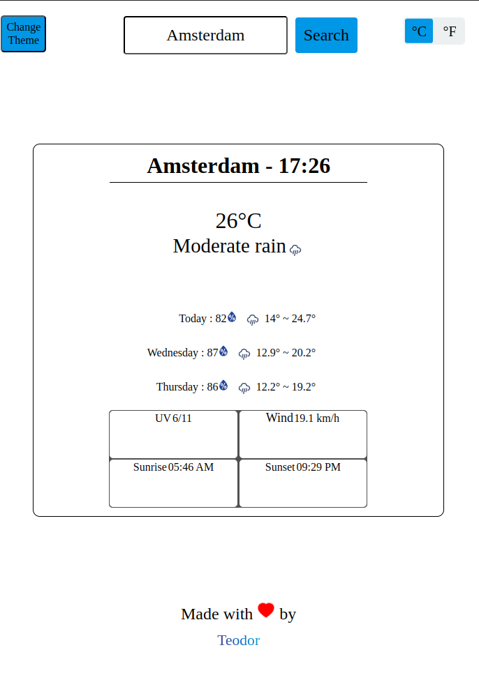

# WeatherApp
A weather web app built using React and Typescript that shows the weather for the upcoming 3 days, along with other metrics such as UV, windspeed and more. The app alows the user to choose between Celsius and Fahrenheit and between Dark and Light themes.

<figure style="margin: 0 10px; text-align: center;">
    
</figure>

<figure style="margin: 0 10px; text-align: center;">
    
</figure>

<figure style="margin: 0 10px; text-align: center;">
    
</figure>

# Usage
Type in the city for which you want to know the weather and hit search or enter. Expect the following:
- Location and current local time
- Temperature in the selected unit along with a general description of the weather (Sunny, Moderate rain, etc)
- 3-day forecast including the humidity, an icon depicting the expected weather and the minimum and maximum temperatures of that day
- UV levels and wind speed
- Time of sunrise and sunset

# Features 
- Change temperature units between Celsius and Fahrenheit by using the toggle slide in the upper right corner
- Change to dark mode by using the toggle button in the upper left corner
